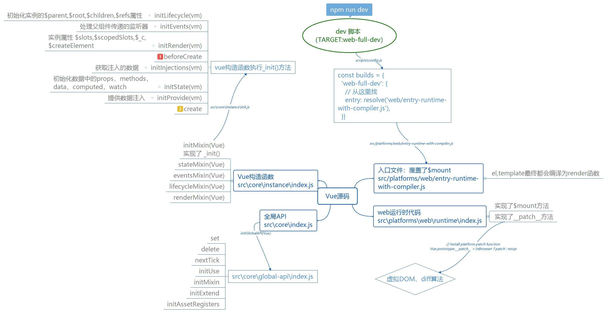

# vue-source-code
The source code to learn of vue.



# files

- dist 打包后输出文件
  - common.js   webpack 1.x  browserfiry （老版本的打包器）
  - esm  webpack 2+
  - umd  兼容cjs和amd
  - runtime  仅包含运行时，无编译器
- flow  类型检查
- examples 测试代码（自己的测试程序 ）
- packages  独立于vue核心代码之外的
- scripts  全部 打包脚本
- src   核心
  - compiler  编译器
  - core   核心代码
  - platforms   平台相关
  - server  服务端渲染
  - sfc    单文件解析
  - shared  公有的帮助文件
- test 测试代码
- types   专门为 typescript 写的类型声明（源码时flow写的）

# 测试环境搭建

1. 初始化（安装依赖） npm i

2. 安装 rollup    npm install rollup --save-dev

3. 修改script脚本

   ```js
   // "dev": "rollup -w -c scripts/config.js --environment TARGET:web-full-dev",
   "dev": "rollup -w -c scripts/config.js  --sourcemap --environment TARGET:web-full-dev",
   ```

   添加 `--sourcemap` ，目的是生成一个 `vue.js.map` 文件，可以在浏览器中调试。

4. 执行脚本 dev 

   ```js 
   npm run dev
   ```

   dist 文件会生成一个  `vue.js.map` 文件。

   为什么不是打包？ 调试需要清楚看到格式化的代码，并不是打包后的一行代码。

   路径：**dist\vue.js.map**

5. 创建测试文件 并 引入vue.js

   **examples\test\test.html**

# 入口文件

```js
"dev": "rollup -w -c scripts/config.js  --sourcemap --environment TARGET:web-full-dev",
```

1. 找到 scripts/config.js 文件

   - 查找 builds 对象 的 'web-full-dev' 属性；

   ```js
   const builds = {
     // Runtime+compiler development build (Browser)
     'web-full-dev': {
       entry: resolve('web/entry-runtime-with-compiler.js'), // 从这里找
       dest: resolve('dist/vue.js'),
       format: 'umd',
       env: 'development',
       alias: { he: './entity-decoder' },
       banner
     }
   }
   ```

   'web/entry-runtime-with-compiler.js'这个web好像没有啊？

   ```js
   const aliases = require('./alias') //scripts\alias.js
   // 别名解析方法
   const resolve = p => {
     const base = p.split('/')[0]
     if (aliases[base]) {
       return path.resolve(aliases[base], p.slice(base.length + 1))
     } else {
       return path.resolve(__dirname, '../', p)
     }
   }
   ```

   **结果：web ===> src/platforms/web**

2. “src/platforms/web/entry-runtime-with-compiler.js”  文件

   拓展了默认的$mount（使用了装饰者模式）；

   无render的情况去下处理el、template ，尝试编译为 render函数；

   ​

   **结果：** 模板优先级？

   render > template > el / $mount

   **补充一点**：el和new Vue().$mount其实是一样的。

   ```js
   //src\core\instance\init.js
   if (vm.$options.el) {
     vm.$mount(vm.$options.el)
   }
   //如果选项里面有el，则帮你执行了vm.$mount()
   ```

3. “src\platforms\web\runtime\index.js”文件

   实现了 $mount 方法 ，执行挂载 ` mountComponent(this, el, hydrating) `

   实现了 patch方法 ，俗称打补丁（虚拟DOM 、 diff 的入口）

4. “src\core\index.js” 文件

   定义了全局API （学习全局API 的入口）==> initGlobalAPI(Vue)

   ```js
   //src\core\global-api\index.js 

   Vue.set = set
   Vue.delete = del
   Vue.nextTick = nextTick

   initUse(Vue)
   initMixin(Vue)
   initExtend(Vue)
   initAssetRegisters(Vue)
   ```

5. "src\core\instance\index.js" 文件 **【Vue构造函数定义】**

   ```js
   function Vue (options) {
     //...
     this._init(options) // ?
   }
   initMixin(Vue) // 实现了 _init()
   stateMixin(Vue) // $data $props $set $delete $watch
   eventsMixin(Vue) // $on $emit $once $off
   lifecycleMixin(Vue) // _update $forceUpdate $destory
   renderMixin(Vue) // $nextTick _render
   ```

### "src\core\instance\init.js"  重点

```js
// expose real self
vm._self = vm
initLifecycle(vm) // 初始化实例的$parent,$root,$children,$refs属性
initEvents(vm) // 处理父组件传递的监听器
initRender(vm) // $slots,$scopedSlots,$_c,$createElement
callHook(vm, 'beforeCreate') //  beforeCreate hook
initInjections(vm) // 获取注入的数据
initState(vm) // 初始化组件中的props,methods,data,computed,watch
initProvide(vm) // 提供数据注入
callHook(vm, 'created')
```

```js
// src\core\instance\render.js
// 这个就是render函数中的h函数
vm.$createElement = (a, b, c, d) => createElement(vm, a, b, c, d, true)
```

Q：为什么是先注入再提供？ 即先initInjections(vm) 再initProvide(vm)

A：除了根组件App，所有的组件都可以获取父亲的数据并传递给自己的子组件，即实现单向数据继承。【单向数据流】